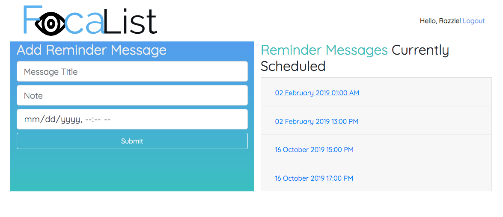

# Focalist The Scheduling App
## Project Description
This is a web application that allows users to create scheduled reminder text messages that are texted to the user at the specified date and time in the future. 

## Contributors
### [Quang Nguyen](https://github.com/TheQuangNguyen)

I am from Vietnam.
I graduated from UW with mechanical engineering degree.
I like software development because I can contribute in creating product that other people use. Plus it is just fun.
I write in Java because it is a widely used backend language and it is very versatile in what the language can do.
Find me on [LinkedIn](https://www.linkedin.com/in/quangnguyendev/) and on [GitHub](https://github.com/TheQuangNguyen).

### [Sharina Stubbs](https://github.com/SharinaS?tab=repositories)

A software developer with a background in medicine, music, and competitive sailing. Committed to building high-quality solutions for global and business solutions. Dedicated to accountable and adaptable teamwork. Find me on [LinkedIn](https://www.linkedin.com/in/sharina-stubbs/) and on [GitHub](https://github.com/SharinaS).

### [Ahren Swett](https://github.com/ahrenswett)
 

# Wireframes for App
Wireframes can be viewed within our public [Trello Board](https://trello.com/b/9v2P4pvL/team-focalpoint). 

# Domain Modeling and Database-Entity-Relationship Diagram
Domain modeling and a Database-Entity-Relationship Diagram can be seen on our [Trello Board](https://trello.com/b/9v2P4pvL/team-focalpoint).

### References
- [Spring Boot - How to send sms using Twilio API (2019)](https://www.youtube.com/watch?v=OuBttmaPlhM)
- [Appointment Reminders with Java and Spark](https://www.twilio.com/docs/sms/tutorials/appointment-reminders-java-spark)

